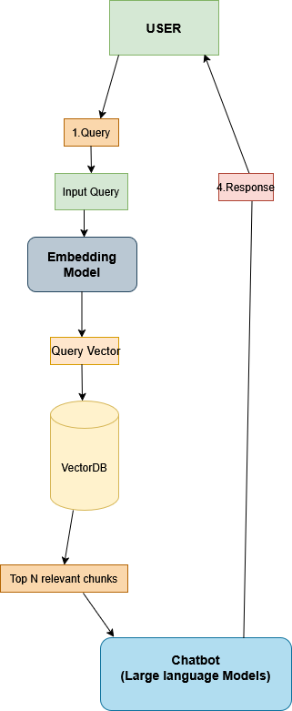

# Basic RAG Implementation

## Overview

This is a simple implementation of Retrieval Augmented Generation (RAG) using Ollama with local language models. The system demonstrates the core concepts of RAG by:

1. Loading a knowledge base of cat facts
2. Creating embeddings for each line of text
3. Searching for the most relevant facts based on semantic similarity
4. Using the retrieved information to generate accurate responses



## How It Works

The implementation follows these steps:

1. **Data Loading**: Text data is loaded from `data.txt`, with each line treated as a separate document chunk
2. **Embedding Generation**: Each chunk is embedded using the CompendiumLabs model through Ollama
3. **Vector Database Creation**: The embeddings and their corresponding text chunks are stored in memory
4. **Query Processing**: 
   - When a user asks a question, the query is embedded using the same model
   - Cosine similarity is calculated between the query embedding and all stored embeddings
   - The top N most similar chunks are retrieved
5. **Response Generation**: The retrieved chunks are used as context for the LLM to generate a relevant response

## Code Explanation

The `basic-rag.py` script:
- Uses Ollama for both embeddings and text generation
- Creates a simple in-memory vector database (the `VECTOR_DB` variable)
- Implements cosine similarity for semantic search
- Constructs a well-formed prompt with retrieved context for the LLM

## Usage

To use this implementation:

```bash
python basic-rag.py
```

When prompted, ask a question about cats. The system will:
1. Retrieve the most relevant cat facts from the knowledge base
2. Show you the retrieved facts and their similarity scores
3. Generate a response based only on the retrieved information

## Models Used

- **Embedding Model**: `hf.co/CompendiumLabs/bge-base-en-v1.5-gguf`
  - [Model Link](https://huggingface.co/CompendiumLabs/bge-base-en-v1.5-gguf)
  - Can be pulled with: `ollama pull hf.co/CompendiumLabs/bge-base-en-v1.5-gguf`

- **Language Model**: `hf.co/bartowski/Llama-3.2-1B-Instruct-GGUF`
  - [Model Link](https://huggingface.co/bartowski/Llama-3.2-1B-Instruct-GGUF)
  - Can be pulled with: `ollama pull hf.co/bartowski/Llama-3.2-1B-Instruct-GGUF`

## Requirements

- Python 3.8+
- Ollama 0.1.22
- Ollama service installed locally ([Ollama website](https://ollama.ai))

## Installation

```bash
# Install Python dependencies
pip install -r requirements.txt

# Pull required models
ollama pull hf.co/CompendiumLabs/bge-base-en-v1.5-gguf
ollama pull hf.co/bartowski/Llama-3.2-1B-Instruct-GGUF
```

## Limitations and Future Improvements

This basic implementation has several limitations:

1. Uses a simple in-memory vector database (not suitable for large datasets)
2. No chunking strategy (each line is treated as a separate document)
3. No preprocessing or cleaning of text
4. Limited to the cat facts dataset

Future improvements could include:
- Adding text preprocessing and cleaning
- Implementing different chunking strategies
- Using a persistent vector database
- Adding support for different file types
